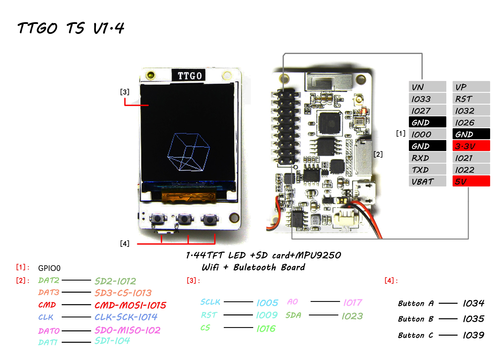
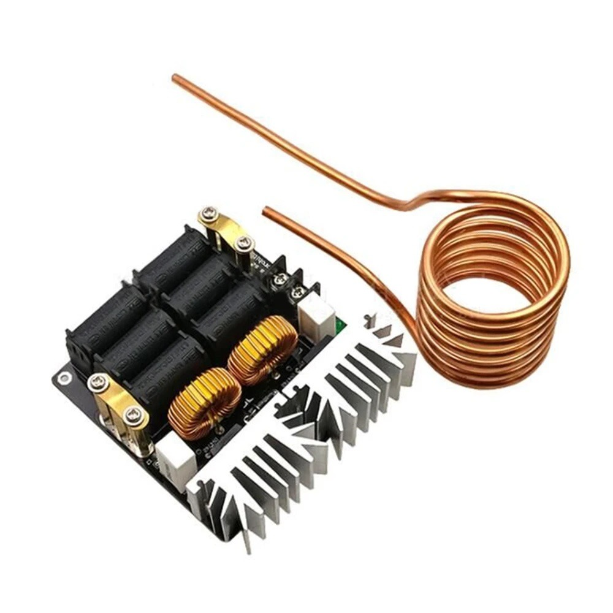
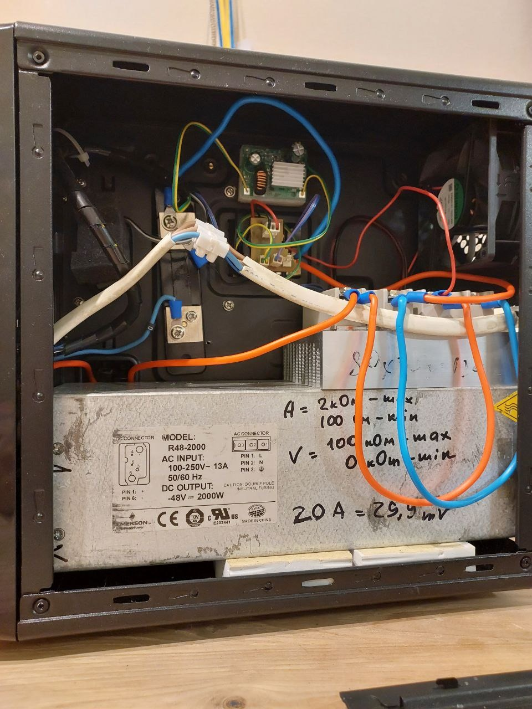
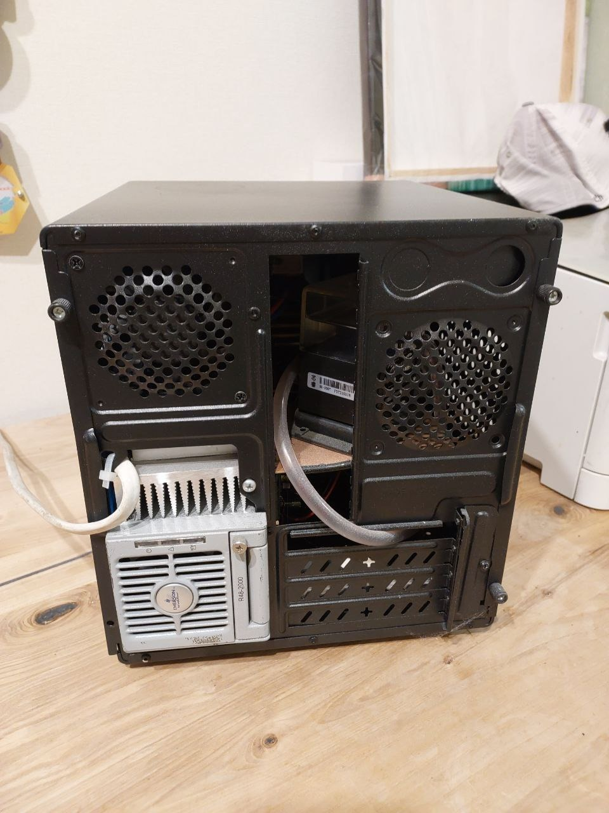
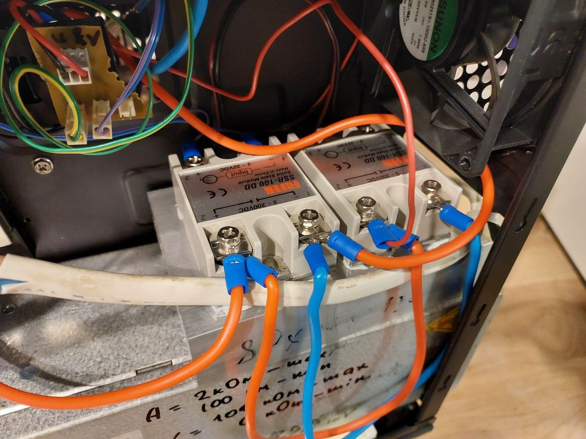
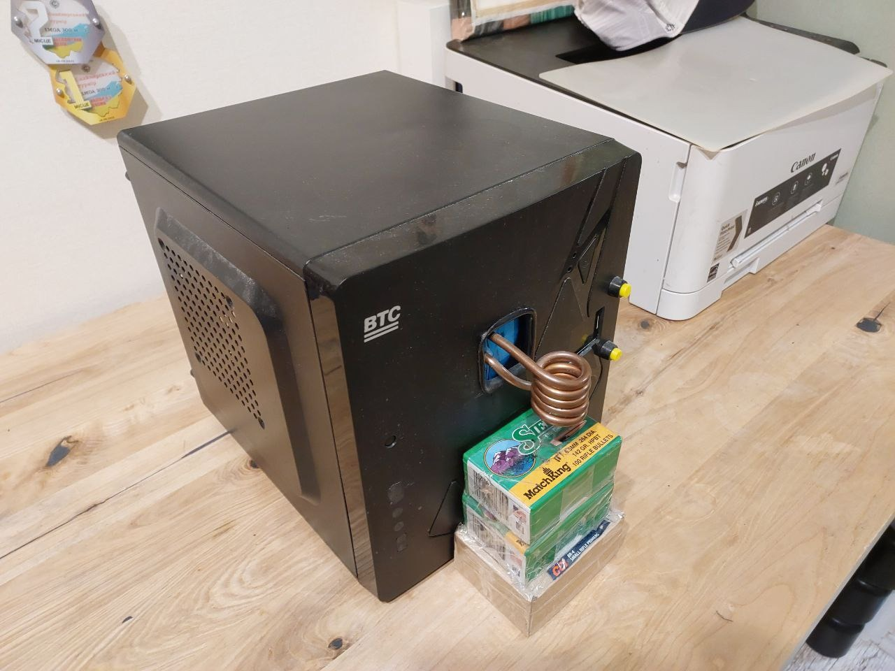

# Induction Annealing Machine for Cartridge Cases

A DIY induction annealing machine designed for heat treating cartridge cases (brass shells). This project provides a cost-effective alternative to commercial solutions using readily available components from AliExpress and other sources.

## Table of Contents

- [Overview](#overview)
- [System Architecture](#system-architecture)
- [Components](#components)
  - [Power Supply](#power-supply)
  - [Induction Heater](#induction-heater)
  - [Control System](#control-system)
  - [Cooling System](#cooling-system)
  - [Relay Module](#relay-module)
- [Hardware Modifications](#hardware-modifications)
- [Software](#software)
- [Operation](#operation)
- [Performance Notes](#performance-notes)
- [Cost Estimate](#cost-estimate)
- [Media](#media)
- [References](#references)

## Overview

This induction annealing machine is designed for heat treating cartridge cases. The system uses a ZVS (Zero Voltage Switching) flyback driver for induction heating, controlled by an ESP32-based microcontroller with a TFT display interface.



**Key Features:**
- Precise time-based annealing control (7-12 seconds typical)
- Temperature monitoring with overheat protection
- Adjustable duration settings stored in EEPROM
- Visual feedback via TFT display
- Solid-state relay control for reliable switching

## System Architecture

The system consists of:
1. **Power Supply**: Emerson R48-1800 providing 48V DC at 20-25A
2. **Induction Module**: 1000W ZVS Flyback Driver
3. **Controller**: ESP32 (TTGO T1.4 V1.4) with TFT display
4. **Relay**: Solid-state relay (SSR) for power control
5. **Cooling**: Active cooling for both the induction board and induction coil
6. **Temperature Monitoring**: DS18B20 sensor for overheat protection

## Components

### Power Supply

**Emerson R48-1800 Power Supply**
- Output: 30-60V adjustable (configured to 48V)
- Current: 20-25A
- Adjustable output parameters
- High-quality industrial power supply (commonly available on OLX/eBay)

**Note**: A current shunt is recommended for measuring current draw.

**Future Enhancement**: Integration of CS5460 power meter for power-based annealing control instead of time-based.

### Induction Heater

**1000W 20A ZVS Flyback Driver**
- Model: Low Voltage Induction Heating Board Power Supply Module
- Self-oscillating circuit (minimal components required)
- **Important**: This unit operates near its maximum capacity



**Technical Details**:  
More information available at: [Kaizer Power Electronics - ZVS Flyback Driver](https://kaizerpowerelectronics.dk/high-voltage/mazilli-zvs-flyback-driver/)

**Performance Notes**:
- Heating time: 7-12 seconds per case provides balanced heating
- After 7-8 cases (.284 Win), a cooldown period is recommended
- Faster heating is not necessarily better (affects repeatability)

### Control System

**Controller Board**: TTGO T1.4 V1.4 Min32 (ESP32-based)


**Features**:
- **Display**: 1.4" TFT display (ST7735 driver)
- **Interface**: 3-button control system
- **Temperature Sensor**: DS18B20 OneWire sensor
- **Storage**: EEPROM for settings persistence
- **Communication**: USB Serial port




**Display Libraries**: TFT_eSPI graphics and font library for ST7735

**Future Enhancement**: CS5460 power meter integration (currently in TODO, attempted connection via SD card socket without success)

### Cooling System

**Induction Board Cooling**:
- Standard 120mm computer fan
- Mounted directly to heatsink with screws
- Active forced-air cooling



**Induction Coil Cooling**:
- CPU water cooling solution
- Recommended products:
  - [Option 1](https://vi.aliexpress.com/item/32263003396.html) - ~$8.50 USD
  - [Option 2](https://vi.aliexpress.com/item/32711190694.html) - ~$14 USD


**Important**: Use thick-walled hoses capable of handling pressure in both directions (including vacuum).

**Power Conversion**: Additional DC-DC converters needed for auxiliary equipment power supply:
- Example: [DC-DC Converter](https://vi.aliexpress.com/item/1005002288373280.html)

### Relay Module

**Solid-State Relay (SSR)**
- Initial: SSR-40DD 40A DC-DC (failed under load)
- Current: Two 100A SSRs in parallel
- **Critical**: Must be mounted on heatsink with thermal paste
- Activated directly by controller (no additional circuitry needed)

## Hardware Modifications

### Induction Board Modifications

1. **Inductor Rewinding**:
   - Rewind inductor to smaller diameter
   - Reduce to 5 turns (from original)

2. **Component Spacing**:
   - Desolder all black components
   - Resolder with minimum 5mm gap between board and components
   - Improves ventilation and heat dissipation
   - **Note**: These are standard microwave oven components

3. **Temperature Sensor Installation**:
   - Install DS18B20 sensor directly on the board
   - Secure firmly in place

### Verification

After power supply and induction coil installation, test functionality:
- Any metal object should heat visibly when placed in the coil
- Bright heating indicates proper operation

## Software

**Firmware**: `induction_rev1.ino`

**Key Features**:
- Time-based annealing control with adjustable duration
- Temperature monitoring via independent ticker
- Overheat alarm (threshold: 80°C)
- EEPROM storage for user settings
- Button interface:
  - Double-click: Enter edit mode for duration
  - Power button: Confirm selection/start-stop

**Libraries Required**:
- `TFT_eSPI` - Display graphics library
- `Button2` - Button handling
- `OneWire` - Temperature sensor communication
- `Ticker` - Independent timing for temperature reading
- `EEPROM` - Settings persistence
- `CS5460` - Power meter (for future implementation)

**Code Repository**: Available at [GitHub](https://github.com/Kotdnz/induction_anneal/blob/main/induction_rev1.ino)

## Operation

### Setup Mode

1. **Enter Edit Mode**: Double-click the yellow (top) button
2. **Adjust Duration**: Use Up/Down buttons to set annealing time
3. **Confirm**: Press Power button to save settings

### Annealing Process

1. **Initial Test**: Turn off lights for first test
   - Case should glow purple (visible in darkness, invisible in light)
   - This indicates proper temperature range

2. **Start Annealing**: Press Power button to begin cycle
   - Controller activates relay
   - Induction heater powers on
   - Timer counts down

3. **Completion**: 
   - System automatically shuts off after set duration
   - Clear boundary line should be visible on case surface
   - Example: .284 Win cases show distinct heat-affected zone




### Safety Features

- **Overheat Protection**: System displays alarm if temperature exceeds 80°C
- **Automatic Shutdown**: Timer-based shutdown prevents overheating
- **Visual Feedback**: Real-time temperature display

## Performance Notes

- **Heating Rate**: 7-12 seconds provides balanced, repeatable results
- **Batch Processing**: After 7-8 cases (.284 Win), allow cooldown period
- **Temperature Control**: Purple glow in darkness indicates proper annealing temperature
- **Repeatability**: Consistent timing ensures uniform results

**Note**: Professional units typically switch at ~220V to eliminate inductive load from the circuit. This DIY solution uses lower voltage switching due to component limitations.

## Cost Estimate

Approximate total cost: **~$200 USD**

This includes:
- Power supply
- Induction module
- Controller board
- Cooling components
- Enclosure
- Various experimental components

*Note: Does not include personal time investment*

## Media

All project images and media files are stored locally in the `media/images/` directory. This ensures the documentation is self-contained and doesn't rely on external hosting services.

### Image Files

The following images are referenced in this documentation:
- `general_view.jpg` - Overall machine view
- `zvs_driver.jpg` - ZVS flyback driver board
- `T10_V1.4.jpg` - Controller board (TTGO T1.4 V1.4)
- `controller_front.jpg` - Controller front view
- `controller_display.jpg` - Controller with display interface
- `controller_detail.jpg` - Additional controller detail view
- `rear_view.jpg` - Rear view showing cooling setup
- `cooling_setup.jpg` - Detailed cooling system view
- `machine_detail.jpg` - Additional machine detail view
- `annealing_result.jpg` - Example of annealed cartridge case
- `case_comparison.jpg` - Before/after comparison
- `display_screenshot.png` - Controller display screenshot
- `system_diagram.png` - System diagram/schematic

### Downloading Images

If images are missing, you can download them from the original Telegraph article:

1. **Automatic Download**: Run the provided script:
   ```bash
   ./download_images.sh
   ```

2. **Manual Download**: 
   - Open the [original Telegraph article](https://telegra.ph/%D0%86ndukc%D1%96jna-normal%D1%96zac%D1%96ya-g%D1%96lz-06-07) in your browser
   - Right-click each image and select "Save Image As..."
   - Save images to `media/images/` directory with the filenames listed above

## References

- **Original Article** (archived): [Telegraph - Індукційна нормалізація гільз](https://telegra.ph/%D0%86ndukc%D1%96jna-normal%D1%96zac%D1%96ya-g%D1%96lz-06-07) - *Note: All content and images have been migrated to this repository*
- **Firmware Source**: [GitHub Repository](https://github.com/Kotdnz/induction_anneal)
- **ZVS Driver Information**: [Kaizer Power Electronics](https://kaizerpowerelectronics.dk/high-voltage/mazilli-zvs-flyback-driver/)

## Contact

For questions or support: kot.dnz@gmail.com

---

**Disclaimer**: This is a DIY project. Exercise appropriate safety precautions when working with high voltage, high current, and high temperature systems. Ensure proper electrical safety measures are in place.
